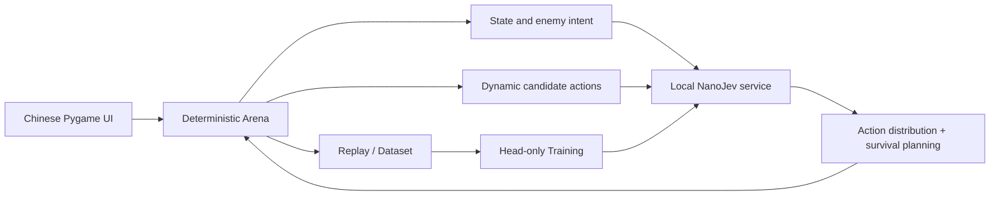

# Jev Arena

<div align="center">

[简体中文](README.md) | **English** | [日本語](README.ja.md) | [한국어](README.ko.md) | [Русский](README.ru.md)

**A fully local tactical arena driven by NanoJev**

[](https://www.python.org/)
[](https://www.pygame.org/)
[](https://github.com/TianyuCodings/NanoJev)
[](#data-generation-and-training)
[](#tests-and-validation)

Not a pre-scripted combat demo: at every step the model faces the real candidate actions and has to choose between moving, attacking, shooting, healing, dashing and environment chain reactions.


*Real game engine + local NanoJev service: campaign level 12, step 10, the model is executing a dash with invincibility frames.*

</div>

## What is this

Jev Arena is a grid-based tactical game that runs entirely locally, and a reproducible playground for NanoJev, rule-based agents and search algorithms.

The player has to collect gems and survive into the next level. Difficulty comes not only from the number of monsters, but from enemy intent, hazardous terrain, limited ammo, skill cooldowns, environmental kills and a combat tempo that keeps speeding up.

The in-game UI and the design documents are written in Chinese; this file is the English edition of the [Chinese README](README.md).

## Features

| System | Current implementation |
| --- | --- |
| Tactical turns | 2 AP per turn; combine move, attack, push, shoot, heal, dash, EMP and wait |
| Four enemy types | Chaser, charger, bomber and archer each have their own HP, damage, movement tempo and attack pattern |
| Readable telegraphs | Lasers, charges and explosions are telegraphed with ground trails and danger zones — no debug-style direction letters or countdowns |
| Active weapons | The compound bow deals high damage and knocks enemies back; the pulse pistol has longer range; weapons and limited ammo persist across levels |
| Skills | Dash covers two tiles with invincibility frames inside the action and picks its direction from target and threat; EMP interrupts nearby enemies |
| Environment | Campfires, spikes, pits and explosive barrels are both threats and tools for kills and chain explosions |
| Safe generation | Gems, medkits and key items always have a damage-free reachable route; spawn points are never laser-locked immediately |
| Chinese UI | Shows model probabilities, decision rationale, inference latency, level difficulty, ammo and skill state in real time |

### Difficulty is not just more monsters

Levels progressively add enemies, obstacles and hazardous terrain; enemy HP grows by +1 per level, attack damage increases in tiers, and different monsters are buffed in stages:

| Level | Tempo change |
| --- | --- |
| 6 | Chasers move faster |
| 12 | Chargers move faster and charge up for less time |
| 18 | Archers move faster and aim for less time |
| 24 | Bombers speed up slightly, chargers enter a second speed tier |

After the first speed-up level, the action interval drops one more tier every 12 levels, always keeping at least one turn of telegraph. Chasers stay fastest, chargers come next, archers and bombers are slower; yellow charge trails and pink aim lines use different animated telegraph styles.

## Quick start

### 1. Prepare the environment

Windows, Python 3.10+ and an NVIDIA GPU are recommended. The default configuration is validated on a GTX 1660 SUPER 6GB.

```powershell
git clone https://github.com/liao96312/jev-arena-nanojev.git
cd jev-arena-nanojev

python -m venv .venv
.\.venv\Scripts\python.exe -m pip install -r requirements-1660s.txt

git clone --branch jev-arena-1660s https://github.com/liao96312/NanoJev.git third_party/NanoJev
```

The compatibility branch is based on upstream [TianyuCodings/NanoJev](https://github.com/TianyuCodings/NanoJev); this repository also keeps [`patches/nanojev-1660s.patch`](patches/nanojev-1660s.patch) so the local adaptations stay auditable.

### 2. Download a checkpoint

```powershell
.\.venv\Scripts\python.exe -c "from huggingface_hub import snapshot_download; snapshot_download(repo_id='C-Tianyu/NanoJev', local_dir='checkpoints/NanoJev', allow_patterns=['variants/games_gold_seed17/*'])"
```

### 3. Launch the game

Double-click **`启动游戏.cmd`** (the "launch game" batch file, Chinese filename) in the project root.

The launcher picks a usable checkpoint, starts the local model service and opens the Chinese game window. If the model service is unavailable the game pauses and shows an error instead of silently switching to another agent.

You can also start it from a terminal:

```powershell
.\.venv\Scripts\python.exe scripts\play_gui.py --agent nanojev --seed 61005
```

## Controls

| Key | Action |
| --- | --- |
| `1` / `2` / `3` / `4` | Switch between Random / Rule / NanoJev / Jev API |
| `←` / `→` | Adjust decision speed |
| `Space` | Pause or resume |
| `R` / `F5` | Restart the current level; the bottom-right button does the same |
| `Esc` | Quit |

Agents decide automatically: the player observes, switches agents and controls the demo tempo.

## How NanoJev participates in decisions



Arena generates the legal actions for the current position and rehearses immediate HP, kills, gems, ammo and next-beat threats by cloning the environment. NanoJev returns a full action distribution; the hybrid policy then handles safe pathing, low-HP healing, ranged hits and anti-backtracking constraints.

All inference runs locally: no remote teacher is called, and failures are never faked.

## Running other agents

```powershell
.\.venv\Scripts\python.exe scripts\play.py --agent random --seed 1
.\.venv\Scripts\python.exe scripts\play.py --agent rule --seed 1
.\.venv\Scripts\python.exe scripts\play.py --agent nanojev --seed 1
.\.venv\Scripts\python.exe scripts\play.py --agent jev --seed 1
```

By default the game only starts the local NanoJev service and never reads or calls the Jev API. The API is used only when you explicitly press `4`, reading the key from `TYPESAFE_API_KEY`, `TYPESAFE_API_KEY_FILE`, or `typesafe-api-key.txt` on the desktop; pressing `1` / `2` / `3` safely switches back to a local agent at any time, and the key is never written into the repository.

Recording and replay:

```powershell
.\.venv\Scripts\python.exe scripts\play.py --agent rule --seed 1 --replay replays/seed1.jsonl
.\.venv\Scripts\python.exe scripts\replay.py replays/seed1.jsonl
```

## Tests and validation

```powershell
.\.venv\Scripts\python.exe -m unittest discover -s tests -v
.\.venv\Scripts\python.exe scripts\benchmark.py --episodes 100
.\.venv\Scripts\python.exe scripts\benchmark.py --episodes 4 --max-ticks 100 `
  --agents nanojev --policy hybrid --campaign-level 3 --max-batch-states 2
```

Environment, combat, maps, weapons, save files, replay, search and model adapters currently share **94 regression tests**.

<details>
<summary><strong>Experiments and baseline results</strong></summary>

- Fixed 100 seeds × 500 ticks: RuleV2 averages 126.95 reward, Random 17.49.
- Beam Teacher on level 3, 10×100: average reward 83.44, RuleV2 69.76.
- MCTS Teacher smoke test, 3×100: average reward 79.33, RuleV2 63.53.
- V2 complexity benchmark: average branching factor 7.317, 79.92% of states have at least 6 actions.
- 2 AP head-only smoke test: dev CE 2.5745 → 2.1137, GTX 1660S peak VRAM 2.53GB.
- 100k stratified quick checkpoint: 1k records, 20 steps, about 5 minutes, dev CE 2.4718 → 2.2208, peak VRAM 2.52GB.
- Real level 3 hybrid benchmark, 4×100: 4/4 collected every gem, 0 deaths.
- Beam Teacher 10k distillation: 500 steps took about 74 minutes; in the same-seed level 3 4x100 comparison the pure model reward rose from 14.35 to 71.53 and collected gems from 0 to 5, but it still cannot clear the level on its own; the hybrid policy reward rose from 98.79 to 106.10, and both cleared 4/4. This is a small-sample smoke test, not a formal 100-seed conclusion.

Detailed files:

- [`baselines/v2/rule_100x500.json`](baselines/v2/rule_100x500.json)
- [`baselines/v2/beam_rule_10x100.json`](baselines/v2/beam_rule_10x100.json)
- [`baselines/v2/mcts_rule_3x100.json`](baselines/v2/mcts_rule_3x100.json)
- [`baselines/v2/complexity_100x100.json`](baselines/v2/complexity_100x100.json)
- [`baselines/v2/nanojev_ap_benchmark_4x100.json`](baselines/v2/nanojev_ap_benchmark_4x100.json)
- [`baselines/v2/beam_distillation_4x100.json`](baselines/v2/beam_distillation_4x100.json)

</details>

## Data generation and training

Generate V2 rollout data:

```powershell
.\.venv\Scripts\python.exe scripts\generate_dataset.py --v2 --records 10000 `
  --targets rollout --rollout-horizon 2 `
  --output datasets/generated/arena_v2_rollout_10k.jsonl
```

Run 100k data generation, validation, token audit and 500-step training in one shot:

```powershell
.\configs\train_nanojev_1660s_v2_100k.ps1
```

Beam Teacher distillation pipeline:

```powershell
.\configs\train_nanojev_beam_teacher_10k.ps1
```

The pipelines support resuming from a checkpoint, and they write a temporary file first, moving it to the final dataset path only after validation, so interrupted artifacts are never mistaken for complete datasets.

## Languages and toolchain

| Language / tool | Main use | Share of the repository |
| --- | --- | --- |
| Python 3.10+ | Game engine, agents and search, data generation, training and evaluation (49 modules) | 96.8% |
| PowerShell | GTX 1660S training pipelines and demo launchers (`configs/`, `scripts/`) | 3.1% |
| Batch | Single-entry launcher `启动游戏.cmd` | under 0.1% |
| Markdown + Mermaid | README plus the V2, ranged-weapon and 1660S design documents | not counted |

## Project layout

```text
arena/            game environment, level generation, enemy logic and rendering
agents/           Random, Rule, MCTS and NanoJev agents
nanojev_adapter/  request protocol, client and hybrid policy
assets/           characters, monsters, items, effects and gameplay screenshots
scripts/          game launcher, evaluation, data and training tools
configs/          reproducible GTX 1660S training pipelines
datasets/         datasets and manifests
baselines/        baseline results and reports
tests/            regression tests
```

## Roadmap

- V2 tactical upgrade plan: [`JEV_ARENA_V2_ROADMAP.md`](JEV_ARENA_V2_ROADMAP.md) (Chinese)
- Ranged weapons plan: [`JEV_ARENA_RANGED_WEAPONS_PLAN.md`](JEV_ARENA_RANGED_WEAPONS_PLAN.md) (Chinese)
- GTX 1660S / NanoJev technical plan: [`jev_arena_nanojev_gtx1660s_plan.md`](jev_arena_nanojev_gtx1660s_plan.md) (Chinese)

The project is still evolving: the goal is not a model that only walks the shortest path, but one whose every action reflects observable, verifiable and reproducible tactical judgement.
