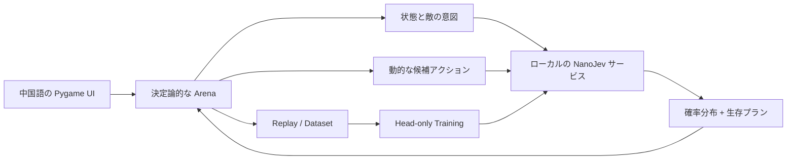

# Jev Arena

<div align="center">

[简体中文](README.md) | [English](README.en.md) | **日本語** | [한국어](README.ko.md) | [Русский](README.ru.md)

**NanoJev によって駆動されるローカル戦術アリーナ**

[](https://www.python.org/)
[](https://www.pygame.org/)
[](https://github.com/TianyuCodings/NanoJev)
[](#データ生成とトレーニング)
[](#テストと検証)

事前に書かれた戦闘スクリプトではなく、毎ステップでモデルが実際の候補アクションに向き合い、移動、攻撃、射撃、回復、ダッシュ、環境の連鎖反応を判断します。


*本物のゲームエンジン + ローカルの NanoJev サービス：レベル 12 のステップ 10、モデルが無敵フレーム付きのダッシュを実行しているところです。*

</div>

## これは何か

Jev Arena は、完全にローカルで実行されるグリッド型戦術ゲームであり、NanoJev、ルールベースエージェント、探索アルゴリズムのための再現可能な実験場でもあります。

プレイヤーは宝石を集め、生きたまま次のレベルへ進む必要があります。難易度はモンスターの数だけでなく、敵の意図、危険な地形、限られた弾薬、スキルのクールダウン、環境によるキル、そしてレベルごとに速くなっていく戦闘テンポから生まれます。

## ゲームの特徴

| システム | 現在の実装 |
| --- | --- |
| 戦術ターン | 毎ターン 2 AP で、移動、攻撃、押し出し、射撃、回復、ダッシュ、EMP、待機を組み合わせられます |
| 4 種類の敵 | チェイサー、チャージャー、ボマー、アーチャーがそれぞれ独自の HP、ダメージ、移動テンポ、攻撃方法を持ちます |
| 読みやすい予告 | レーザー、突撃、爆発は地上の軌跡と危険ゾーンで予告され、デバッグ用の方向アルファベットやカウントダウンは表示されません |
| アクティブな武器 | コンパウンドボウは高ダメージとノックバックを備え、パルスピストルはより長い射程を持ちます。武器と限られた弾薬はレベルをまたいで保持されます |
| スキル | ダッシュは 2 マスを移動し、アクション中に無敵フレームを得ます。方向は対象と脅威に応じて選ばれます。EMP は近くの敵の行動を中断できます |
| 環境インタラクション | 焚き火、スパイク、落とし穴、爆発樽は脅威であると同時に、敵を倒したり連鎖爆発を引き起こしたりする手段にも使えます |
| 安全な生成 | 宝石、回復キット、主要アイテムには必ず無傷で到達可能な経路が保証され、スポーン地点がすぐにレーザーでロックされることはありません |
| 中国語 UI | モデルの確率、選択の根拠、推論時間、レベルの難易度、武器の弾薬、スキル状態をリアルタイムで表示します |

### 難易度は単なるモンスターの物量ではない

レベルが進むにつれて敵、障害物、危険な地形が徐々に追加されます。敵の HP はレベルごとに +1、各種攻撃のダメージは段階的に増加し、同時に異なるモンスターが段階的に強化されます：

| レベル | テンポ変化 |
| --- | --- |
| レベル 6 | チェイサーの移動が高速化 |
| レベル 12 | チャージャーの移動が高速化し、チャージ時間が短縮 |
| レベル 18 | アーチャーの移動が高速化し、照準時間が短縮 |
| レベル 24 | ボマーがやや高速化し、チャージャーは第 2 速度段階へ |

最初の速度上昇レベルを過ぎた後は、12 レベルごとに行動間隔がさらに 1 段階短縮されますが、予告は最低 1 ターン分必ず残ります。チェイサーは常に最速、次にチャージャー、アーチャーとボマーはさらに遅く、黄色の突撃軌跡とピンクの射撃照準ラインはそれぞれ異なるアニメーション予告スタイルを使います。

## クイックスタート

### 1. 環境の準備

Windows、Python 3.10+、NVIDIA 製 GPU の使用を推奨します。本プロジェクトのデフォルト設定は GTX 1660 SUPER 6GB で検証されています。

```powershell
git clone https://github.com/liao96312/jev-arena-nanojev.git
cd jev-arena-nanojev

python -m venv .venv
.\.venv\Scripts\python.exe -m pip install -r requirements-1660s.txt

git clone --branch jev-arena-1660s https://github.com/liao96312/NanoJev.git third_party/NanoJev
```

この互換ブランチは上流の [TianyuCodings/NanoJev](https://github.com/TianyuCodings/NanoJev) をベースにしており、本リポジトリにはローカル適用の監査に便利な [`patches/nanojev-1660s.patch`](patches/nanojev-1660s.patch) も保持しています。

### 2. checkpoint のダウンロード

```powershell
.\.venv\Scripts\python.exe -c "from huggingface_hub import snapshot_download; snapshot_download(repo_id='C-Tianyu/NanoJev', local_dir='checkpoints/NanoJev', allow_patterns=['variants/games_gold_seed17/*'])"
```

### 3. ゲームの起動

プロジェクトルートにある **`启动游戏.cmd`** を直接ダブルクリックしてください。

ランチャーは利用可能な checkpoint を自動的に選択し、ローカルのモデルサービスを起動して、中国語のゲームウィンドウを開きます。モデルサービスが利用できない場合はゲームが一時停止してエラーを表示し、黙って別のエージェントへ切り替わることはありません。

ターミナルから起動することもできます：

```powershell
.\.venv\Scripts\python.exe scripts\play_gui.py --agent nanojev --seed 61005
```

## 操作方法

| キー | 機能 |
| --- | --- |
| `1` / `2` / `3` / `4` | Random / Rule / NanoJev / Jev API の切り替え |
| `←` / `→` | 意思決定速度の調整 |
| `Space` | 一時停止 / 再開 |
| `R` / `F5` | 現在のレベルのやり直し。右下のボタンからも可能 |
| `Esc` | 終了 |

ゲームの意思決定はエージェントが自動で行い、プレイヤーは観察、エージェントの切り替え、デモのテンポ制御を担当します。

## NanoJev はどのように意思決定に関わるか



Arena は現在の局面に応じて合法アクションを生成し、環境をクローンして即時の HP、キル、宝石、弾薬、次の tick の脅威を先読みします。NanoJev は完全なアクション確率を返し、hybrid ポリシーが安全な経路探索、低 HP 時の回復、遠距離ヒット、引き返し防止の制約を処理します。

モデルの推論は完全にローカルで行われ、リモートの教師モデルを呼び出すことも、失敗時に結果を捏造することもありません。

## 他のエージェントを実行する

```powershell
.\.venv\Scripts\python.exe scripts\play.py --agent random --seed 1
.\.venv\Scripts\python.exe scripts\play.py --agent rule --seed 1
.\.venv\Scripts\python.exe scripts\play.py --agent nanojev --seed 1
.\.venv\Scripts\python.exe scripts\play.py --agent jev --seed 1
```

ゲームはデフォルトでローカルの NanoJev だけを起動し、Jev API の読み取りや呼び出しは行いません。明示的に `4` を押したときだけ、`TYPESAFE_API_KEY`、`TYPESAFE_API_KEY_FILE`、またはデスクトップ上の `typesafe-api-key.txt` からキーを読み込んで API を呼び出します。`1` / `2` / `3` を押せばいつでも安全にローカルエージェントへ切り替えられ、キーがリポジトリに書き込まれることはありません。

記録とリプレイ：

```powershell
.\.venv\Scripts\python.exe scripts\play.py --agent rule --seed 1 --replay replays/seed1.jsonl
.\.venv\Scripts\python.exe scripts\replay.py replays/seed1.jsonl
```

## テストと検証

```powershell
.\.venv\Scripts\python.exe -m unittest discover -s tests -v
.\.venv\Scripts\python.exe scripts\benchmark.py --episodes 100
.\.venv\Scripts\python.exe scripts\benchmark.py --episodes 4 --max-ticks 100 `
  --agents nanojev --policy hybrid --campaign-level 3 --max-batch-states 2
```

現在、環境、戦闘、マップ、武器、セーブデータ、Replay、探索、モデルアダプターを合わせて **94 項目の回帰テスト** があります。

<details>
<summary><strong>実験とベースライン結果</strong></summary>

- 固定 100 seed × 500 tick：RuleV2 の平均報酬は 126.95、Random は 17.49。
- Beam Teacher レベル 3 で 10×100：平均報酬 83.44、RuleV2 は 69.76。
- MCTS Teacher 3×100 スモークテスト：平均報酬 79.33、RuleV2 は 63.53。
- V2 複雑度ベンチマーク：平均分岐係数 7.317、79.92% の状態に 6 つ以上のアクションが存在。
- 2 AP head-only スモークテスト：dev CE 2.5745 → 2.1137、GTX 1660S ピーク VRAM 2.53GB。
- 100k 層化サンプリング quick checkpoint：1k レコード、20 steps、約 5 分、dev CE 2.4718 → 2.2208、ピーク VRAM 2.52GB。
- 実レベル 3 の 4×100 hybrid ベンチマーク：4/4 で全宝石を回収、死亡 0。
- Beam Teacher 10k 蒸留は 500 ステップで約 74 分。同一シードのレベル 3・4x100 比較では、純モデルの報酬が 14.35 → 71.53、ジェムが 0 → 5 に上昇しましたが、単独クリアには至っていません。ハイブリッド方策は報酬 98.79 → 106.10 で、どちらも 4/4 クリア。これは小規模なスモークテストであり、正式な 100-seed の結論ではありません。

詳細ファイル：

- [`baselines/v2/rule_100x500.json`](baselines/v2/rule_100x500.json)
- [`baselines/v2/beam_rule_10x100.json`](baselines/v2/beam_rule_10x100.json)
- [`baselines/v2/mcts_rule_3x100.json`](baselines/v2/mcts_rule_3x100.json)
- [`baselines/v2/complexity_100x100.json`](baselines/v2/complexity_100x100.json)
- [`baselines/v2/nanojev_ap_benchmark_4x100.json`](baselines/v2/nanojev_ap_benchmark_4x100.json)
- [`baselines/v2/beam_distillation_4x100.json`](baselines/v2/beam_distillation_4x100.json)

</details>

## データ生成とトレーニング

V2 rollout データを生成：

```powershell
.\.venv\Scripts\python.exe scripts\generate_dataset.py --v2 --records 10000 `
  --targets rollout --rollout-horizon 2 `
  --output datasets/generated/arena_v2_rollout_10k.jsonl
```

100k データ生成、検証、トークン監査、500-step トレーニングをワンコマンドで実行：

```powershell
.\configs\train_nanojev_1660s_v2_100k.ps1
```

Beam Teacher 蒸留パイプライン：

```powershell
.\configs\train_nanojev_beam_teacher_10k.ps1
```

パイプラインはチェックポイントからの再開に対応しており、まず一時ファイルに書き込み、検証が完了してから正式なデータパスへ移動します。これにより、中断時の途中成果物が完全なデータセットと誤認されることを防ぎます。

## 使用言語と技術スタック

| 言語 / ツール | 主な用途 | リポジトリ比率 |
| --- | --- | --- |
| Python 3.10+ | ゲームエンジン、エージェントと探索、データ生成、トレーニングと評価（49 モジュール） | 96.8% |
| PowerShell | GTX 1660S トレーニングパイプラインとワンコマンドのデモスクリプト（`configs/`、`scripts/`） | 3.1% |
| Batch | ワンクリック起動エントリ `启动游戏.cmd` | 0.1% 以下 |
| Markdown + Mermaid | README と V2 / 遠距離武器 / 1660S の技術設計ドキュメント | 集計対象外 |

## プロジェクト構成

```text
arena/            ゲーム環境、レベル生成、敵ロジックとレンダリング
agents/           Random、Rule、MCTS、NanoJev エージェント
nanojev_adapter/  リクエストプロトコル、クライアント、hybrid 方策
assets/           キャラクター、モンスター、アイテム、エフェクト、実機スクリーンショット
scripts/          ゲーム起動、評価、データと学習のツール
configs/          GTX 1660S 再現可能な学習パイプライン
datasets/         データセットと manifest
baselines/        ベースライン結果とレポート
tests/            回帰テスト
```

## ロードマップ

- V2 戦術アップグレード計画：[`JEV_ARENA_V2_ROADMAP.md`](JEV_ARENA_V2_ROADMAP.md)
- 遠距離武器計画：[`JEV_ARENA_RANGED_WEAPONS_PLAN.md`](JEV_ARENA_RANGED_WEAPONS_PLAN.md)
- GTX 1660S / NanoJev 技術設計：[`jev_arena_nanojev_gtx1660s_plan.md`](jev_arena_nanojev_gtx1660s_plan.md)

プロジェクトは今も継続的にイテレーションを重ねています。目標は、最短経路を歩くだけのモデルではなく、すべてのアクションに観察可能・検証可能・再現可能な戦術判断が表れるモデルを作ることです。
