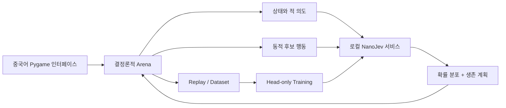

# Jev Arena

<div align="center">

[简体中文](README.md) | [English](README.en.md) | [日本語](README.ja.md) | **한국어** | [Русский](README.ru.md)

**NanoJev로 구동되는 로컬 전술 아레나**

[](https://www.python.org/)
[](https://www.pygame.org/)
[](https://github.com/TianyuCodings/NanoJev)
[](#데이터-생성과-훈련)
[](#테스트와-검증)

미리 짜 둔 전투 스크립트가 아니라, 모델이 매 스텝마다 실제 후보 행동을 마주하고 이동, 공격, 사격, 치유, 대시, 환경 연쇄를 판단합니다.


*실제 게임 엔진 + 로컬 NanoJev 서비스: 12 레벨 10번째 스텝, 모델이 무적 프레임이 포함된 대시를 실행하고 있습니다.*

</div>

## 이것은 무엇인가

Jev Arena는 완전히 로컬에서 실행되는 그리드 전술 게임이자, NanoJev와 규칙 기반 에이전트, 탐색 알고리즘을 위한 재현 가능한 실험장입니다.

플레이어는 보석을 모으고 살아남아 다음 레벨로 진입해야 합니다. 난이도는 몬스터의 수만이 아니라 적의 의도, 위험 지형, 한정된 탄약, 스킬 재사용 대기시간, 환경 킬, 그리고 레벨마다 빨라지는 전투 템포에서 나옵니다.

## 게임 특징

| 시스템 | 현재 구현 |
| --- | --- |
| 전술 턴 | 턴당 2 AP로 이동, 공격, 밀치기, 사격, 치유, 대시, EMP, 대기를 조합할 수 있습니다 |
| 네 종류의 적 | 추격 몬스터, 돌진 몬스터, 폭탄 몬스터, 사수 몬스터가 각자 고유한 체력, 피해, 이동 템포와 공격 방식을 가집니다 |
| 읽기 쉬운 예고 | 레이저, 돌진, 폭발은 지면 궤적과 위험 구역으로 예고되며, 디버그식 방향 문자나 카운트다운은 표시하지 않습니다 |
| 능동 무기 | 복합궁은 피해가 높고 적을 밀어내며, 펄스 권총은 사거리가 더 깁니다. 무기와 한정된 탄약은 레벨을 넘어 유지됩니다 |
| 스킬 | 대시는 두 칸을 이동하며 행동 내내 무적 프레임을 얻고, 대상과 위협에 따라 방향을 선택합니다. EMP는 주변 적을 중단시킬 수 있습니다 |
| 환경 상호작용 | 모닥불, 지면 가시, 구덩이, 폭발 드럼통은 위협인 동시에 적 처치와 연쇄 폭발을 일으키는 도구로도 쓸 수 있습니다 |
| 안전한 생성 | 보석, 구급 키트, 핵심 아이템에는 항상 무피해 도달 경로가 존재하도록 보장되며, 스폰 지점이 즉시 레이저로 고정되는 일은 없습니다 |
| 중국어 인터페이스 | 모델 확률, 선택 근거, 추론 소요 시간, 레벨 난이도, 무기 탄약, 스킬 상태를 실시간으로 표시합니다 |

### 난이도는 단순히 몬스터를 늘리는 것이 아닙니다

레벨이 오를수록 적, 장애물, 위험 지형이 점점 추가되고, 적 체력은 레벨당 +1씩, 각 공격의 피해는 단계별로 증가하며, 서로 다른 몬스터가 단계에 따라 강화됩니다:

| 레벨 | 템포 변화 |
| --- | --- |
| 6 레벨 | 추격 몬스터 이동 속도 증가 |
| 12 레벨 | 돌진 몬스터 이동 속도 증가, 충전 시간 단축 |
| 18 레벨 | 사수 몬스터 이동 속도 증가, 조준 시간 단축 |
| 24 레벨 | 폭탄 몬스터는 소폭 빨라지고, 돌진 몬스터는 두 번째 속도 단계에 진입 |

첫 속도 상승 레벨을 지나면 이후 12 레벨마다 행동 간격이 한 단계 더 짧아지지만, 최소 1턴의 예고는 항상 남습니다. 추격 몬스터가 항상 가장 빠르고 돌진 몬스터가 그다음, 사수 몬스터와 폭탄 몬스터는 더 느립니다. 노란색 돌진 궤적과 분홍색 사격 조준선은 서로 다른 동적 예고 스타일을 사용합니다.

## 빠른 시작

### 1. 환경 준비

Windows, Python 3.10+와 NVIDIA 그래픽 카드 사용을 권장합니다. 이 프로젝트의 기본 설정은 GTX 1660 SUPER 6GB를 기준으로 검증되었습니다.

```powershell
git clone https://github.com/liao96312/jev-arena-nanojev.git
cd jev-arena-nanojev

python -m venv .venv
.\.venv\Scripts\python.exe -m pip install -r requirements-1660s.txt

git clone --branch jev-arena-1660s https://github.com/liao96312/NanoJev.git third_party/NanoJev
```

호환 브랜치는 업스트림 [TianyuCodings/NanoJev](https://github.com/TianyuCodings/NanoJev)를 기반으로 하며, 로컬 적용 내역을 감사할 수 있도록 이 저장소에 [`patches/nanojev-1660s.patch`](patches/nanojev-1660s.patch)도 보관되어 있습니다.

### 2. 체크포인트 다운로드

```powershell
.\.venv\Scripts\python.exe -c "from huggingface_hub import snapshot_download; snapshot_download(repo_id='C-Tianyu/NanoJev', local_dir='checkpoints/NanoJev', allow_patterns=['variants/games_gold_seed17/*'])"
```

### 3. 게임 시작

프로젝트 루트 디렉터리의 **`启动游戏.cmd`**를 더블클릭하기만 하면 됩니다.

런처는 사용 가능한 체크포인트를 자동으로 선택하고, 로컬 모델 서비스를 시작한 뒤 중국어 게임 창을 엽니다. 모델 서비스를 사용할 수 없으면 게임이 일시 정지되고 오류가 표시되며, 다른 에이전트로 자동 전환되지 않습니다.

터미널에서 시작할 수도 있습니다:

```powershell
.\.venv\Scripts\python.exe scripts\play_gui.py --agent nanojev --seed 61005
```

## 조작법

| 키 | 기능 |
| --- | --- |
| `1` / `2` / `3` / `4` | Random / Rule / NanoJev / Jev API 전환 |
| `←` / `→` | 의사 결정 속도 조절 |
| `Space` | 일시 정지 또는 재개 |
| `R` / `F5` | 현재 레벨 재시작, 오른쪽 아래 버튼으로도 가능 |
| `Esc` | 종료 |

게임은 에이전트가 자동으로 의사 결정을 내리며, 플레이어는 관찰하고, 에이전트를 전환하며, 데모 속도를 조절합니다.

## NanoJev는 의사 결정에 어떻게 참여하는가



Arena는 현재 국면에서 합법적인 행동을 생성하고, 환경을 복제해 즉각적인 체력 변화, 처치, 보석, 탄약과 다음 틱의 위협을 미리 확인합니다. NanoJev는 전체 행동 확률을 반환하며, hybrid 정책이 안전한 길찾기, 낮은 체력일 때의 치유, 원거리 명중, 되돌아감 방지 제약을 처리합니다.

모델 추론은 전부 로컬에서 이루어지며, 원격 티처를 호출하지 않고 실패했을 때 결과를 날조하지도 않습니다.

## 다른 에이전트 실행

```powershell
.\.venv\Scripts\python.exe scripts\play.py --agent random --seed 1
.\.venv\Scripts\python.exe scripts\play.py --agent rule --seed 1
.\.venv\Scripts\python.exe scripts\play.py --agent nanojev --seed 1
.\.venv\Scripts\python.exe scripts\play.py --agent jev --seed 1
```

게임은 기본적으로 로컬 NanoJev만 시작하며, Jev API를 읽거나 호출하지 않습니다. `4`를 명시적으로 눌렀을 때만 `TYPESAFE_API_KEY`, `TYPESAFE_API_KEY_FILE` 또는 바탕 화면의 `typesafe-api-key.txt`에서 키를 읽어 API를 호출하며, `1` / `2` / `3`을 누르면 언제든 안전하게 로컬 에이전트로 전환할 수 있고 키는 저장소에 기록되지 않습니다.

기록 및 재생:

```powershell
.\.venv\Scripts\python.exe scripts\play.py --agent rule --seed 1 --replay replays/seed1.jsonl
.\.venv\Scripts\python.exe scripts\replay.py replays/seed1.jsonl
```

## 테스트와 검증

```powershell
.\.venv\Scripts\python.exe -m unittest discover -s tests -v
.\.venv\Scripts\python.exe scripts\benchmark.py --episodes 100
.\.venv\Scripts\python.exe scripts\benchmark.py --episodes 4 --max-ticks 100 `
  --agents nanojev --policy hybrid --campaign-level 3 --max-batch-states 2
```

현재 환경, 전투, 맵, 무기, 세이브, Replay, 탐색, 모델 어댑터 전반에 걸쳐 **94개의 회귀 테스트**가 있습니다.

<details>
<summary><strong>실험과 베이스라인 결과</strong></summary>

- 고정 100 시드 × 500 틱: RuleV2 평균 보상 126.95, Random 17.49.
- Beam Teacher 3 레벨 10×100: 평균 보상 83.44, RuleV2 69.76.
- MCTS Teacher 3×100 스모크 테스트: 평균 보상 79.33, RuleV2 63.53.
- V2 복잡도 벤치마크: 평균 분기 계수 7.317, 79.92%의 상태에 최소 6개의 행동이 존재.
- 2 AP head-only 스모크 테스트: dev CE 2.5745 → 2.1137, GTX 1660S 피크 VRAM 2.53GB.
- 100k 층화 샘플링 quick checkpoint: 1k 레코드, 20 steps, 약 5분, dev CE 2.4718 → 2.2208, 피크 VRAM 2.52GB.
- 실제 3 레벨 4×100 hybrid 벤치마크: 4/4에서 보석을 모두 수집, 사망 0건.
- Beam Teacher 10k 증류는 500 스텝에 약 74분이 걸렸습니다. 동일 시드 레벨 3 4x100 비교에서 순수 모델 보상은 14.35 → 71.53, 젬은 0 → 5로 올랐지만 단독 클리어는 아직 불가능합니다. 하이브리드 정책 보상은 98.79 → 106.10이었고 둘 다 4/4 클리어했습니다. 이는 소규모 스모크 테스트이며 공식 100-seed 결론이 아닙니다.

상세 파일:

- [`baselines/v2/rule_100x500.json`](baselines/v2/rule_100x500.json)
- [`baselines/v2/beam_rule_10x100.json`](baselines/v2/beam_rule_10x100.json)
- [`baselines/v2/mcts_rule_3x100.json`](baselines/v2/mcts_rule_3x100.json)
- [`baselines/v2/complexity_100x100.json`](baselines/v2/complexity_100x100.json)
- [`baselines/v2/nanojev_ap_benchmark_4x100.json`](baselines/v2/nanojev_ap_benchmark_4x100.json)
- [`baselines/v2/beam_distillation_4x100.json`](baselines/v2/beam_distillation_4x100.json)

</details>

## 데이터 생성과 훈련

V2 rollout 데이터 생성:

```powershell
.\.venv\Scripts\python.exe scripts\generate_dataset.py --v2 --records 10000 `
  --targets rollout --rollout-horizon 2 `
  --output datasets/generated/arena_v2_rollout_10k.jsonl
```

100k 데이터 생성, 검증, 토큰 감사, 500-step 훈련을 한 번에 실행:

```powershell
.\configs\train_nanojev_1660s_v2_100k.ps1
```

Beam Teacher 증류 파이프라인:

```powershell
.\configs\train_nanojev_beam_teacher_10k.ps1
```

파이프라인은 중단된 지점부터 이어서 실행할 수 있으며, 임시 파일을 먼저 기록한 뒤 검증을 마쳐야 정식 데이터 경로로 옮기므로, 중간에 끊긴 산출물이 완전한 데이터셋으로 오인되지 않습니다.

## 주요 언어와 기술 스택

| 언어 / 도구 | 주요 용도 | 저장소 비중 |
| --- | --- | --- |
| Python 3.10+ | 게임 엔진, 에이전트와 탐색, 데이터 생성, 훈련과 평가 (49개 모듈) | 96.8% |
| PowerShell | GTX 1660S 훈련 파이프라인과 원클릭 데모 스크립트 (`configs/`, `scripts/`) | 3.1% |
| Batch | 원클릭 시작 진입점 `启动游戏.cmd` | 0.1% 미만 |
| Markdown + Mermaid | README와 V2 / 원거리 무기 / 1660S 기술 방안 문서 | 통계에서 제외 |

## 프로젝트 구조

```text
arena/            게임 환경, 레벨 생성, 적 로직과 렌더링
agents/           Random, Rule, MCTS와 NanoJev 에이전트
nanojev_adapter/  요청 프로토콜, 클라이언트와 hybrid 정책
assets/           캐릭터, 몬스터, 아이템, 이펙트와 실제 플레이 스크린샷
scripts/          게임 시작, 평가, 데이터와 훈련 도구
configs/          GTX 1660S 재현 가능 훈련 파이프라인
datasets/         데이터셋과 manifest
baselines/        베이스라인 결과와 보고서
tests/            회귀 테스트
```

## 로드맵

- V2 전술 업그레이드 계획: [`JEV_ARENA_V2_ROADMAP.md`](JEV_ARENA_V2_ROADMAP.md)
- 원거리 무기 계획: [`JEV_ARENA_RANGED_WEAPONS_PLAN.md`](JEV_ARENA_RANGED_WEAPONS_PLAN.md)
- GTX 1660S / NanoJev 기술 방안: [`jev_arena_nanojev_gtx1660s_plan.md`](jev_arena_nanojev_gtx1660s_plan.md)

프로젝트는 계속 발전하고 있습니다. 목표는 최단 경로만 걷는 모델이 아니라, 모든 행동에서 관찰 가능하고 검증 가능하며 재현 가능한 전술 판단을 드러내는 모델입니다.
