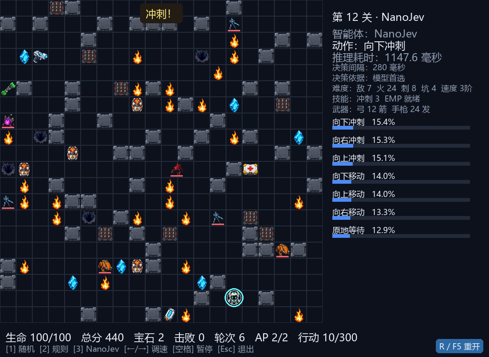
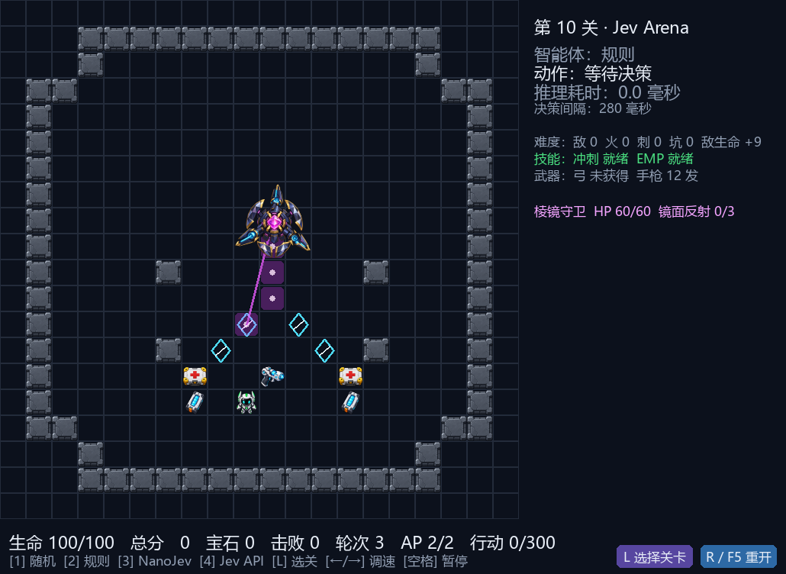
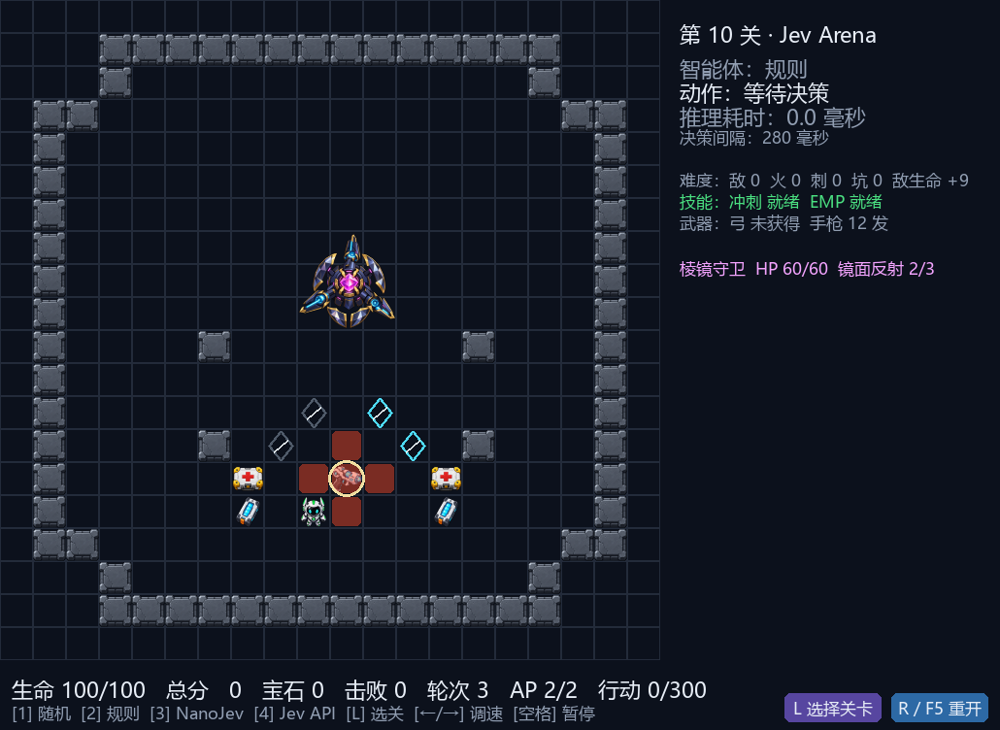
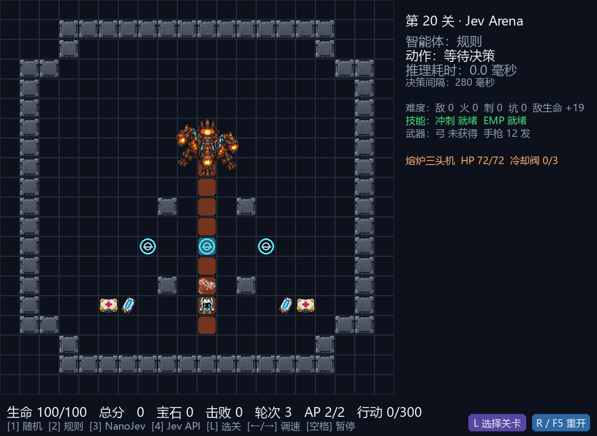
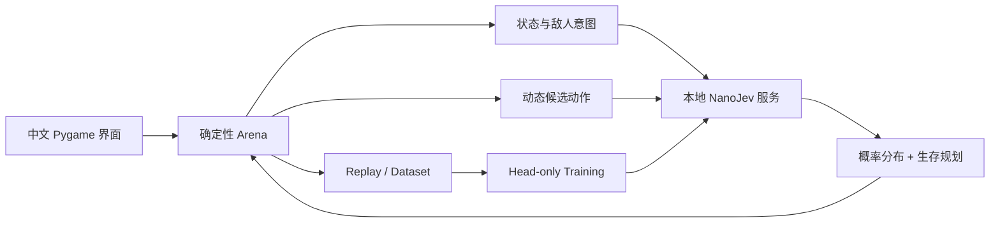

# Jev Arena

<div align="center">

**简体中文** | [English](README.en.md) | [日本語](README.ja.md) | [한국어](README.ko.md) | [Русский](README.ru.md)

**由 NanoJev 驱动的本地战术竞技场**

[](https://www.python.org/)
[](https://www.pygame.org/)
[](https://github.com/TianyuCodings/NanoJev)
[](#数据生成与训练)
[](#测试与验证)

不是预先写好的战斗脚本，而是让模型在每一步面对真实候选动作，判断移动、攻击、射击、治疗、冲刺与环境连锁。



*真实游戏引擎 + 本地 NanoJev 服务：第 12 关第 10 步，模型正在执行带无敌帧的冲刺。*

</div>

## 这是什么

Jev Arena 是一个完全本地运行的网格战术游戏，也是 NanoJev、规则代理和搜索算法的可复现实验场。

玩家需要收集宝石并活着进入下一关。难度不只来自怪物数量，还来自敌人意图、危险地形、有限弹药、技能冷却、环境击杀和逐级加快的战斗节奏。

## 游戏特色

| 系统 | 当前实现 |
| --- | --- |
| 战术回合 | 每轮 2 AP，可组合移动、攻击、推动、射击、治疗、冲刺、EMP 与等待 |
| 四类敌人 | 追击怪、冲锋怪、炸弹怪、射手怪拥有独立生命、伤害、移动节奏和攻击方式 |
| 可读预警 | 激光、冲锋与爆炸通过地面轨迹和危险区域预警，不显示调试式方向字母与倒计时 |
| 主动武器 | 复合弓伤害高并击退；脉冲手枪射程更远；武器和有限弹药跨关保存 |
| 技能 | 冲刺两格并在动作内获得无敌帧，会按目标与威胁选择方向；EMP 可打断附近敌人 |
| 环境互动 | 火堆、地刺、深坑和爆炸桶既是威胁，也能用于击杀敌人和触发连锁爆炸 |
| 安全生成 | 宝石、血包和关键道具保证存在无伤可达路线，出生点不会立刻遭到激光锁定 |
| 中文界面 | 实时显示模型概率、选择依据、推理耗时、关卡难度、武器弹药和技能状态 |
| 首个 Boss | 第 10 关棱镜守卫：4 根错位镜柱每轮护盾只能各用一次；诱导 3 次不同反射破盾，躲开有预告的突进，再攻击核心 |
| 第二只 Boss | 第 20 关熔炉三头机：更大的锻炉形房间、熔岩边道、弓与箭束补给；火球锁定伤害 16、熔岩波伤害 22；站上对应冷却阀化解火线，3 阀完成后攻击核心 |

第 10 关 Boss 实机画面（紫色实线与亮格为实际攻击路径，镜柱可反射弹体）：





第 10 关核心开放 3 回合。默认 NanoJev 的混合策略现会主动寻找未使用的镜柱诱导位，破盾后优先射击；纯模型模式仍保留原始模型选择。棱镜射线伤害 14，突进伤害 24；炸药桶爆炸为菱形 2 格范围、基础伤害 25。

第 20 关熔炉三头机的熔岩波预警；青色冷却阀、血包、复合弓和箭束都在独立的锻炉房内：



第 30～100 关 Boss 目前仍是[设计规划](JEV_ARENA_BOSS_ROADMAP.md)，选关不等于这些 Boss 已实装。

### 难度不是简单堆怪

关卡会逐步增加敌人、障碍和危险地形；敌人生命每关 +1，各类攻击伤害分段增长，同时分阶段强化不同怪物：

| 关卡 | 节奏变化 |
| --- | --- |
| 第 6 关 | 追击怪移动加快 |
| 第 12 关 | 冲锋怪移动加快，蓄力时间缩短 |
| 第 18 关 | 射手怪移动加快，瞄准时间缩短 |
| 第 24 关 | 炸弹怪小幅加快，冲锋怪进入第二速度档 |

越过首次提速关卡后，每 12 关再缩短一档行动间隔，最低仍保留 1 轮预警。追击怪始终最快，冲锋怪次之，射手怪和炸弹怪更慢；黄色冲锋轨迹与粉色射击准线使用不同的动态预警样式。

## 快速开始

### 1. 准备环境

推荐使用 Windows、Python 3.10+ 和 NVIDIA 显卡。本项目的默认配置针对 GTX 1660 SUPER 6GB 验证。

```powershell
git clone https://github.com/liao96312/jev-arena-nanojev.git
cd jev-arena-nanojev

python -m venv .venv
.\.venv\Scripts\python.exe -m pip install -r requirements-1660s.txt

git clone --branch jev-arena-1660s https://github.com/liao96312/NanoJev.git third_party/NanoJev
```

兼容分支基于上游 [TianyuCodings/NanoJev](https://github.com/TianyuCodings/NanoJev)，本仓库也保留了 [`patches/nanojev-1660s.patch`](patches/nanojev-1660s.patch) 便于审计本地适配。

### 2. 下载 checkpoint

```powershell
.\.venv\Scripts\python.exe -c "from huggingface_hub import snapshot_download; snapshot_download(repo_id='C-Tianyu/NanoJev', local_dir='checkpoints/NanoJev', allow_patterns=['variants/games_gold_seed17/*'])"
```

### 3. 启动游戏

直接双击项目根目录的 **`启动游戏.cmd`**。

启动器会自动选择可用 checkpoint、启动本地模型服务，并打开中文游戏窗口。模型服务不可用时游戏会暂停并显示错误，不会静默切换成其他代理。

也可以从终端启动：

```powershell
.\.venv\Scripts\python.exe scripts\play_gui.py --agent nanojev --seed 61005
```

## 操作

| 按键 | 功能 |
| --- | --- |
| `1` / `2` / `3` / `4` | 切换 Random / Rule / NanoJev / Jev API |
| `←` / `→` | 调整决策速度 |
| `Space` | 暂停或继续 |
| `R` / `F5` | 重开当前关；也可点击右下角按钮 |
| `L` | 打开中文选关窗口，输入 1～100；也可点击“选择关卡”按钮 |
| `Esc` | 退出 |

游戏由代理自动决策，玩家负责观察、切换代理和控制演示节奏。

## NanoJev 如何参与决策



Arena 会根据当前局面生成合法动作，并通过克隆环境预演即时生命、击杀、宝石、弹药和下一拍威胁。NanoJev 返回完整动作概率；hybrid 策略再处理安全寻路、低血治疗、远程命中和防折返约束。

模型推理完全在本地完成，不调用远程教师，也不在失败时伪造结果。

## 运行其他代理

```powershell
.\.venv\Scripts\python.exe scripts\play.py --agent random --seed 1
.\.venv\Scripts\python.exe scripts\play.py --agent rule --seed 1
.\.venv\Scripts\python.exe scripts\play.py --agent nanojev --seed 1
.\.venv\Scripts\python.exe scripts\play.py --agent jev --seed 1
```

游戏默认只启动本地 NanoJev，不读取或调用 Jev API。只有显式按 `4` 时才会从
`TYPESAFE_API_KEY`、`TYPESAFE_API_KEY_FILE` 或桌面的 `typesafe-api-key.txt` 读取密钥并调用 API；
按 `1` / `2` / `3` 可随时安全切回本地智能体，密钥不会写入仓库。

记录与重放：

```powershell
.\.venv\Scripts\python.exe scripts\play.py --agent rule --seed 1 --replay replays/seed1.jsonl
.\.venv\Scripts\python.exe scripts\replay.py replays/seed1.jsonl
```

## 测试与验证

```powershell
.\.venv\Scripts\python.exe -m unittest discover -s tests -v
.\.venv\Scripts\python.exe scripts\benchmark.py --episodes 100
.\.venv\Scripts\python.exe scripts\benchmark.py --episodes 4 --max-ticks 100 `
  --agents nanojev --policy hybrid --campaign-level 3 --max-batch-states 2
```

当前环境、战斗、地图、武器、存档、Replay、搜索与模型适配共有 **99 项回归测试**。

<details>
<summary><strong>实验与基线结果</strong></summary>

- 固定 100 seed × 500 tick：RuleV2 平均奖励 126.95，Random 为 17.49。
- Beam Teacher 第 3 关 10×100：平均奖励 83.44，RuleV2 为 69.76。
- MCTS Teacher 3×100 烟测：平均奖励 79.33，RuleV2 为 63.53。
- V2 复杂度基准：平均分支因子 7.317，79.92% 状态至少有 6 个动作。
- 2 AP head-only 烟测：dev CE 2.5745 → 2.1137，GTX 1660S 峰值显存 2.53GB。
- 100k 分层抽样 quick checkpoint：1k 条、20 steps、约 5 分钟，dev CE 2.4718 → 2.2208，峰值显存 2.52GB。
- 真实第 3 关 4×100 hybrid benchmark：4/4 收齐宝石，0 死亡。
- Beam Teacher 10k 蒸馏 500 步耗时约 74 分钟；同种子第 3 关 4×100 对照中，纯模型奖励从 14.35 升至 71.53、宝石从 0 升至 5，但仍未独立通关；混合策略奖励从 98.79 升至 106.10，两者均 4/4 通关。此为小样本烟测，不代表正式 100-seed 结论。

详细文件：

- [`baselines/v2/rule_100x500.json`](baselines/v2/rule_100x500.json)
- [`baselines/v2/beam_rule_10x100.json`](baselines/v2/beam_rule_10x100.json)
- [`baselines/v2/mcts_rule_3x100.json`](baselines/v2/mcts_rule_3x100.json)
- [`baselines/v2/complexity_100x100.json`](baselines/v2/complexity_100x100.json)
- [`baselines/v2/nanojev_ap_benchmark_4x100.json`](baselines/v2/nanojev_ap_benchmark_4x100.json)
- [`baselines/v2/beam_distillation_4x100.json`](baselines/v2/beam_distillation_4x100.json)

</details>

## 数据生成与训练

生成 V2 rollout 数据：

```powershell
.\.venv\Scripts\python.exe scripts\generate_dataset.py --v2 --records 10000 `
  --targets rollout --rollout-horizon 2 `
  --output datasets/generated/arena_v2_rollout_10k.jsonl
```

一键执行 100k 数据生成、校验、token 审计和 500-step 训练：

```powershell
.\configs\train_nanojev_1660s_v2_100k.ps1
```

Beam Teacher 蒸馏流水线：

```powershell
.\configs\train_nanojev_beam_teacher_10k.ps1
```

流水线支持断点续跑，并先写临时文件，完成校验后才移动到正式数据路径，避免中断产物被误认为完整数据集。

## 常用语言与技术栈

| 语言 / 工具 | 主要用途 | 仓库占比 |
| --- | --- | --- |
| Python 3.10+ | 游戏引擎、代理与搜索、数据生成、训练与评测（49 个模块） | 96.8% |
| PowerShell | GTX 1660S 训练流水线、一键演示脚本（`configs/`、`scripts/`） | 3.1% |
| Batch | 一键启动入口 `启动游戏.cmd` | 0.1% 以下 |
| Markdown + Mermaid | README 与 V2 / 远程武器 / 1660S 技术方案文档 | 不计入统计 |

## 项目结构

```text
arena/            游戏环境、关卡生成、敌人逻辑与渲染
agents/           Random、Rule、MCTS 与 NanoJev Agent
nanojev_adapter/  请求协议、客户端和 hybrid 策略
assets/           角色、怪物、道具、特效与实机截图
scripts/          游戏启动、评测、数据与训练工具
configs/          GTX 1660S 可复现训练流水线
datasets/         数据集与 manifest
baselines/        基准结果和报告
tests/            回归测试
```

## 路线图

- V2 战术升级规划：[`JEV_ARENA_V2_ROADMAP.md`](JEV_ARENA_V2_ROADMAP.md)
- 10～100 关 Boss 设定与素材：[`JEV_ARENA_BOSS_ROADMAP.md`](JEV_ARENA_BOSS_ROADMAP.md)
- 远程武器规划：[`JEV_ARENA_RANGED_WEAPONS_PLAN.md`](JEV_ARENA_RANGED_WEAPONS_PLAN.md)
- GTX 1660S / NanoJev 技术方案：[`jev_arena_nanojev_gtx1660s_plan.md`](jev_arena_nanojev_gtx1660s_plan.md)

项目仍在持续迭代：目标不是让模型只会走最短路，而是让每个动作都体现可观察、可验证、可复现的战术判断。
