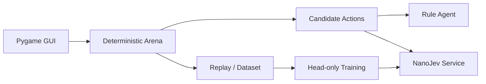

# Jev Arena

**语言：** 简体中文


完全本地的网格决策实验场。当前实现覆盖确定性 Arena、动态候选动作、
Random/Rule/NanoJev Agent、Pygame、Replay、数据生成、统一 seed Benchmark 和 1660S head-only 训练。

V1 已冻结为 [`v1-baseline`](https://github.com/liao96312/jev-arena-nanojev/tree/v1-baseline)，
奖励、复杂度和数据集基线见 [`baselines/v1/summary.json`](baselines/v1/summary.json)；后续按
[`JEV_ARENA_V2_ROADMAP.md`](JEV_ARENA_V2_ROADMAP.md) 推进战术博弈升级。
V2 Phase 1 已加入确定性的敌人 Intent：GUI、Observation 与 Replay 会提前显示敌人的移动或近战方向及倒计时。
Charger 会以橙色标记显示冲锋预告，沿直线冲刺并能撞伤其它敌人。
相邻敌人会动态提供 Shove 动作，可推入火焰、墙或其它敌人；环境击杀单独计数并写入 Replay。
Bomber 使用独立紫色贴图并显示两回合爆炸倒计时，爆炸会同时伤害玩家和范围内其它敌人。
Chaser、Charger、Bomber、Archer 均使用 imagegen 生成的独立透明贴图；Archer 行为尚未启用。
玩家在路径畅通时可向四个方向 Dash 两格，技能冷却 3 回合；Observation、动态候选与 GUI 会显示技能状态。
RuleAgentV2 通过一回合 `clone()+step()` 与下一次 Intent 威胁评分选择动作，能利用 Shove、躲避爆炸并使用 Dash。
固定 100 seed × 500 tick 下平均奖励为 126.95（Random 17.49），0 死亡，结果见
[`baselines/v2/rule_100x500.json`](baselines/v2/rule_100x500.json)。

Windows 直接双击项目根目录的 **`启动游戏.cmd`** 即可自动启动模型和中文游戏界面。

## 核心能力

| 模块 | 能力 |
| --- | --- |
| Arena | 确定性网格环境、动态候选动作与多关卡难度 |
| Agent | Random、Rule 与 NanoJev 三种决策实现 |
| 交互 | 中文 Pygame 界面、速度调节与模型故障提示 |
| 数据 | Replay、rollout 数据生成、校验、token 审计与 manifest |
| 评测 | 统一 seed Benchmark、稳定性与延迟验收 |
| 训练 | 面向 GTX 1660S 的 FP32 head-only 训练配置 |

## 系统架构



## 快速开始

```powershell
git clone https://github.com/liao96312/jev-arena-nanojev.git
cd jev-arena-nanojev
python -m venv .venv
.\.venv\Scripts\python.exe -m pip install -r requirements-1660s.txt
git clone --branch jev-arena-1660s https://github.com/liao96312/NanoJev.git third_party/NanoJev
```

随后按下方命令下载 checkpoint。完成后双击 **`启动游戏.cmd`**，启动器会自动启动模型服务和游戏。
`jev-arena-1660s` 基于上游提交 `71a513b`；`patches/nanojev-1660s.patch` 同时保留为离线补丁。

## 运行与验证

```powershell
python -m unittest discover -s tests -v
python scripts/benchmark.py --episodes 100
python scripts/benchmark.py --episodes 4 --max-ticks 100 --agents nanojev --policy hybrid
python scripts/play.py --agent rule --seed 1
python scripts/play.py --agent nanojev --seed 1
python scripts/play_gui.py --agent nanojev --seed 61005
python scripts/play.py --agent rule --seed 1 --replay replays/seed1.jsonl
python scripts/replay.py replays/seed1.jsonl
python scripts/generate_dataset.py --records 1000
python scripts/generate_dataset.py --records 20000 --targets rollout `
  --output datasets/generated/arena_rollout_memory_20k.jsonl
python scripts/generate_dataset.py --records 1000 --targets rollout `
  --output datasets/generated/arena_rollout_shaped_1k.jsonl
python scripts/generate_dataset.py --records 100000 --targets rollout `
  --output datasets/generated/arena_rollout_shaped_100k.jsonl
python scripts/validate_dataset.py datasets/generated/arena_rule_1k.jsonl
python scripts/audit_tokens.py datasets/generated/arena_rollout_memory_20k.jsonl
```

Arena 核心只依赖 Python 标准库；Pygame 与 NanoJev 依赖见 `requirements-1660s.txt`。
GUI 使用关卡模式：收齐本关宝石后自动进入下一关并保留累计总分；敌人、火焰、墙、
伤害和补给会随关卡递增/递减。敌人每两个主角回合移动一次，进入接触距离会立即造成伤害；
hybrid 策略使用避开墙、敌人和火焰的 BFS 宝石路线，并由 NanoJev 在同长候选中选择，
避免走廊内反复折返。`[` / `]` 可实时调整决策速度。

NanoJev 本地服务（GTX 1660S 使用 FP32）：

```powershell
cd third_party/NanoJev
..\..\.venv\Scripts\python.exe scripts\serve_decisions.py `
  --checkpoint-dir ..\..\runs\arena_rollout_memory_head_50step `
  --web-root web --host 127.0.0.1 --port 8765 --precision fp32
```

上面是当前 Arena 实测最好的 checkpoint；上游原始 checkpoint 位于
`checkpoints/NanoJev/variants/games_gold_seed17`。

下载游戏 checkpoint：

```powershell
.\.venv\Scripts\python.exe -c "from huggingface_hub import snapshot_download; snapshot_download(repo_id='C-Tianyu/NanoJev', local_dir='checkpoints/NanoJev', allow_patterns=['variants/games_gold_seed17/*'])"
```

1660S head-only smoke train：

```powershell
.\.venv\Scripts\python.exe third_party\NanoJev\scripts\train_pipeline_decisions.py `
  --input datasets\generated\arena_rollout_shaped_1k.jsonl --output-dir runs\arena_rollout_shaped_head_50step `
  --init-checkpoint checkpoints\NanoJev\variants\games_gold_seed17 `
  --objective gold_distribution --loss ce --freeze-backbone --backbone-lr 0 `
  --head-steps 0 --steps 50 --batch-questions 8 --microbatch-questions 1 `
  --max-microbatch-tokens 1024 --eval-every 10 --max-length 192 `
  --head-lr 2e-4 --precision fp32
```

可复现的 500-step 配置：

```powershell
.\configs\train_nanojev_1660s_500step.ps1
```

本机兼容环境使用 `torch 2.6.0+cu124`，因此不传仅适用于新版 PyTorch
`torch._native` 的 `--disable-native-triton`；模型仍显式使用 SDPA。

500-step 冻结骨干训练的离线与游戏回归结果：dev CE 从
50-step 的 1.4941 降至 1.4841，峰值显存 2.445 GB；但 1k 数据长训后的纯模型游戏收益退化，
因此该 checkpoint 只作为训练验收产物，没有替换默认模型。`runs/` 为本地生成目录，不纳入仓库。

Random/Rule 在当前接触伤害规则下的 100 seed × 500 tick 正式基线平均奖励分别为 6.91 和
144.11。20k 训练集的真实候选路径 token 长度 P50/P95/最大值为 123/126/135，
全部低于 `max_length=192`。

稳定性验收中，同一模型实例连续完成 10 局、1000 次真实决策，0 死亡、0 异常，平均 P95 为 283.9 ms。
模型服务不可用时，GUI 会暂停并显示中文错误提示，不会偷偷切换到其他 Agent。

本地验收产物 `runs/validation/decision_response.json` 保存了真实 request/response、执行元数据和
GPU 遥测（FP32 常驻显存 2.386 GB、网络模型调用 0）；
[`arena_rollout_memory_20k.manifest.json`](datasets/generated/arena_rollout_memory_20k.manifest.json)
保存了 20k 数据的 SHA-256、seed group 和 split 计数。

正式 100k rollout 数据位于 `datasets/generated/arena_rollout_shaped_100k.jsonl`（147.5 MB）；
[`manifest`](datasets/generated/arena_rollout_shaped_100k.manifest.json) 记录了 SHA-256、2,066 个
seed group 和 70/10/5/10/5 split，且已通过 NanoJev `--validate-only`。

## 目录结构

```text
arena/            网格环境与规则
agents/           Random、Rule 与 NanoJev Agent
nanojev_adapter/  NanoJev 请求与响应适配
scripts/          游戏、评测、数据与训练脚本
configs/          可复现训练配置
datasets/         生成数据与 manifest
tests/            环境和决策回归测试
```

## 当前状态

本项目是可运行的本地实验场。默认 checkpoint 已通过连续 10 局、1000 次真实决策稳定性验收；100k rollout 数据与 1660S 训练链路可复现，模型质量仍在迭代。
