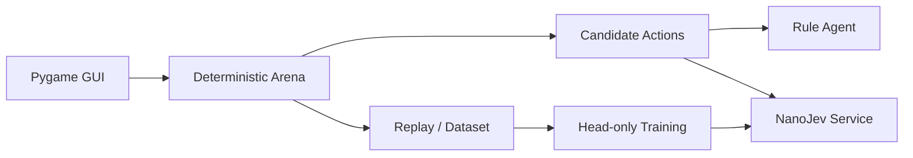

# Jev Arena

**语言：** 简体中文


完全本地的网格决策实验场。当前实现覆盖确定性 Arena、动态候选动作、
Random/Rule/NanoJev Agent、Pygame、Replay、数据生成、统一 seed Benchmark 和 1660S head-only 训练。

V1 已冻结为 [`v1-baseline`](https://github.com/liao96312/jev-arena-nanojev/tree/v1-baseline)，
奖励、复杂度和数据集基线见 [`baselines/v1/summary.json`](baselines/v1/summary.json)；后续按
[`JEV_ARENA_V2_ROADMAP.md`](JEV_ARENA_V2_ROADMAP.md) 推进战术博弈升级。
V2 Phase 1 已加入确定性的敌人 Intent：GUI、Observation 与 Replay 会提前显示敌人的移动或近战方向及倒计时。
Charger 会以橙色标记显示冲锋预告，沿直线冲刺并能撞伤其它敌人。
相邻敌人会动态提供 Shove 动作，可推入火焰、墙或其它敌人；环境击杀单独计数并写入 Replay。
Bomber 使用独立紫色贴图并显示两回合爆炸倒计时，爆炸会同时伤害玩家和范围内其它敌人。
Chaser、Charger、Bomber、Archer 均使用 imagegen 生成的独立透明贴图。Archer 会提前两回合
显示粉色射线并沿直线射击，玩家可以横向躲避，挡在射线上的其它敌人会先受到伤害。
玩家在路径畅通时可向四个方向 Dash 两格，技能冷却 3 回合；Observation、动态候选与 GUI 会显示技能状态。
玩家可拾取复合弓和脉冲手枪：弓射程 6、伤害 15 并击退，手枪射程 8、伤害 12；
武器与有限弹药跨关并保存到 `saves/campaign.json`，箭束和能量弹匣可补充弹药。
敌人进入相邻一格时会动态提供 EMP 动作，可打断近战、冲锋和爆炸，冷却 4 回合。
Chaser 按基础节奏追击，Charger 普通移动较慢但冲锋更快，Bomber 与 Archer 普通移动再慢一拍。
四类敌人拥有独立属性：Chaser 生命 30；Charger 生命 45、近战更强；Bomber 生命 24；
Archer 生命 20、近战较弱。Bomber 与 Archer 的普通移动冷却也比 Charger 更长。
地图生成会验证出生点至少两个出口、全部宝石可达且存在立即可存活动作；死图最多重生成 20 次。
第 2 关起会出现可阻挡移动和射线的爆炸桶；近战、远程武器、冲锋、Archer 或 Bomber
都能引爆，并对范围内玩家、敌人、Bomber 和其它桶产生连锁伤害。
V2 关卡每轮提供 2 AP：玩家可连续组合推动、移动、攻击、Dash、EMP、治疗或等待；
AP 用尽后才统一结算敌人 Intent。轮次与剩余 AP 会显示在中文界面、Observation 和 Replay 中。
第 2 关起加入尖刺地板，踩中会受伤；第 3 关起加入深坑，普通移动无法进入，
但 Shove、弓箭击退或 Charger 冲锋可令敌人坠坑并立即死亡。怪物寻路会主动避开尖刺与深坑。
RuleAgentV2 通过一回合 `clone()+step()` 与下一次 Intent 威胁评分选择动作，能利用 Shove、躲避爆炸并使用 Dash。
固定 100 seed × 500 tick 下平均奖励为 126.95（Random 17.49），0 死亡，结果见
[`baselines/v2/rule_100x500.json`](baselines/v2/rule_100x500.json)。
V2 复杂度基准中 RuleV2 平均分支因子为 7.317，79.92% 状态有至少 6 个动作，抽样状态的
立即/两步必死率均为 0；完整指标见 [`baselines/v2/complexity_100x100.json`](baselines/v2/complexity_100x100.json)。
Observation V2 会输出最近两个敌人的类型短码、Intent 与倒计时，并用环境规则标记即时威胁；
Candidate V2 会在克隆环境中预演一回合，给出实际 HP/击杀/宝石变化和下一拍伤害。
10k 条 2 AP V2 rollout 的候选路径 token 审计为 P50/P95/最大值 167/180/192，结果与数据哈希见
[`arena_v2_rollout_10k.manifest.json`](datasets/generated/arena_v2_rollout_10k.manifest.json)，可继续使用 `max_length=192`。
pre-AP 数据在 GTX 1660S 上的 50-step head-only 烟测将 dev CE 从 2.5932 降至 2.1505，test/OOD CE 为
2.1711/2.1520，峰值显存 2.52GB；完整指标见
[`nanojev_v2_smoke_50step.json`](baselines/v2/nanojev_v2_smoke_50step.json)。
2 AP 数据的对应烟测将 dev CE 从 2.5745 降至 2.1137，test/OOD CE 为 2.1486/2.1545，
峰值显存 2.53GB；完整指标见
[`nanojev_v2_ap_smoke_50step.json`](baselines/v2/nanojev_v2_ap_smoke_50step.json)。
真实第 3 关 4×100 行动 smoke benchmark 中，hybrid 4/4 局收齐宝石且 0 死亡；纯模型策略
0 宝石并频繁折返，说明目前仍需要 planner 导航。结果见
[`nanojev_ap_benchmark_4x100.json`](baselines/v2/nanojev_ap_benchmark_4x100.json)，正式 benchmark 暂不勾选。

Windows 直接双击项目根目录的 **`启动游戏.cmd`** 即可自动启动模型和中文游戏界面。

## 核心能力

| 模块 | 能力 |
| --- | --- |
| Arena | 确定性网格环境、动态候选动作与多关卡难度 |
| Agent | Random、Rule 与 NanoJev 三种决策实现 |
| 交互 | 中文 Pygame 界面、速度调节与模型故障提示 |
| 数据 | Replay、rollout 数据生成、校验、token 审计与 manifest |
| 评测 | 统一 seed Benchmark、稳定性与延迟验收 |
| 训练 | 面向 GTX 1660S 的 FP32 head-only 训练配置 |

## 系统架构



## 快速开始

```powershell
git clone https://github.com/liao96312/jev-arena-nanojev.git
cd jev-arena-nanojev
python -m venv .venv
.\.venv\Scripts\python.exe -m pip install -r requirements-1660s.txt
git clone --branch jev-arena-1660s https://github.com/liao96312/NanoJev.git third_party/NanoJev
```

随后按下方命令下载 checkpoint。完成后双击 **`启动游戏.cmd`**，启动器会自动启动模型服务和游戏。
`jev-arena-1660s` 基于上游提交 `71a513b`；`patches/nanojev-1660s.patch` 同时保留为离线补丁。

## 运行与验证

```powershell
python -m unittest discover -s tests -v
python scripts/benchmark.py --episodes 100
python scripts/benchmark.py --episodes 4 --max-ticks 100 --agents nanojev --policy hybrid
python scripts/benchmark.py --episodes 4 --max-ticks 100 --agents nanojev --policy hybrid `
  --campaign-level 3 --max-batch-states 2
python scripts/play.py --agent rule --seed 1
python scripts/play.py --agent nanojev --seed 1
python scripts/play_gui.py --agent nanojev --seed 61005
python scripts/play.py --agent rule --seed 1 --replay replays/seed1.jsonl
python scripts/replay.py replays/seed1.jsonl
python scripts/generate_dataset.py --records 1000
python scripts/generate_dataset.py --records 20000 --targets rollout `
  --output datasets/generated/arena_rollout_memory_20k.jsonl
python scripts/generate_dataset.py --records 1000 --targets rollout `
  --output datasets/generated/arena_rollout_shaped_1k.jsonl
python scripts/generate_dataset.py --records 100000 --targets rollout `
  --output datasets/generated/arena_rollout_shaped_100k.jsonl
python scripts/generate_dataset.py --v2 --records 10000 --targets rollout --rollout-horizon 2 `
  --output datasets/generated/arena_v2_rollout_10k.jsonl
python scripts/validate_dataset.py datasets/generated/arena_rule_1k.jsonl
python scripts/audit_tokens.py datasets/generated/arena_rollout_memory_20k.jsonl
```

Arena 核心只依赖 Python 标准库；Pygame 与 NanoJev 依赖见 `requirements-1660s.txt`。
GUI 使用关卡模式：收齐本关宝石后自动进入下一关并保留累计总分；敌人、火焰、墙、
伤害和补给会随关卡递增/递减。敌人每两个主角回合移动一次，进入接触距离会立即造成伤害；
hybrid 策略使用避开墙、敌人和火焰的 BFS 宝石路线，并由 NanoJev 在同长候选中选择，
避免走廊内反复折返。`[` / `]` 可实时调整决策速度。

NanoJev 本地服务（GTX 1660S 使用 FP32）：

```powershell
cd third_party/NanoJev
..\..\.venv\Scripts\python.exe scripts\serve_decisions.py `
  --checkpoint-dir ..\..\runs\arena_v2_ap_smoke_head_50step `
  --web-root web --host 127.0.0.1 --port 8765 --precision fp32
```

启动器会优先使用上面的 2 AP checkpoint，缺失时回退到旧训练模型，再回退到上游原始模型。上游原始 checkpoint 位于
`checkpoints/NanoJev/variants/games_gold_seed17`。

下载游戏 checkpoint：

```powershell
.\.venv\Scripts\python.exe -c "from huggingface_hub import snapshot_download; snapshot_download(repo_id='C-Tianyu/NanoJev', local_dir='checkpoints/NanoJev', allow_patterns=['variants/games_gold_seed17/*'])"
```

1660S head-only smoke train：

```powershell
.\.venv\Scripts\python.exe third_party\NanoJev\scripts\train_pipeline_decisions.py `
  --input datasets\generated\arena_rollout_shaped_1k.jsonl --output-dir runs\arena_rollout_shaped_head_50step `
  --init-checkpoint checkpoints\NanoJev\variants\games_gold_seed17 `
  --objective gold_distribution --loss ce --freeze-backbone --backbone-lr 0 `
  --head-steps 0 --steps 50 --batch-questions 8 --microbatch-questions 1 `
  --max-microbatch-tokens 1024 --eval-every 10 --max-length 192 `
  --head-lr 2e-4 --precision fp32
```

V2 10k smoke train 使用相同冻结骨干配置，但需将输入换为
`datasets\generated\arena_v2_rollout_10k.jsonl`，并设置
`--max-microbatch-tokens 4096 --eval-every 50` 以容纳完整武器候选集合、避免重复全量评估。

可复现的 500-step 配置：

```powershell
.\configs\train_nanojev_1660s_500step.ps1
```

本机兼容环境使用 `torch 2.6.0+cu124`，因此不传仅适用于新版 PyTorch
`torch._native` 的 `--disable-native-triton`；模型仍显式使用 SDPA。

500-step 冻结骨干训练的离线与游戏回归结果：dev CE 从
50-step 的 1.4941 降至 1.4841，峰值显存 2.445 GB；但 1k 数据长训后的纯模型游戏收益退化，
因此该 checkpoint 只作为训练验收产物，没有替换默认模型。`runs/` 为本地生成目录，不纳入仓库。

Random/Rule 在当前接触伤害规则下的 100 seed × 500 tick 正式基线平均奖励分别为 6.91 和
144.11。20k 训练集的真实候选路径 token 长度 P50/P95/最大值为 123/126/135，
全部低于 `max_length=192`。

稳定性验收中，同一模型实例连续完成 10 局、1000 次真实决策，0 死亡、0 异常，平均 P95 为 283.9 ms。
模型服务不可用时，GUI 会暂停并显示中文错误提示，不会偷偷切换到其他 Agent。

本地验收产物 `runs/validation/decision_response.json` 保存了真实 request/response、执行元数据和
GPU 遥测（FP32 常驻显存 2.386 GB、网络模型调用 0）；
[`arena_rollout_memory_20k.manifest.json`](datasets/generated/arena_rollout_memory_20k.manifest.json)
保存了 20k 数据的 SHA-256、seed group 和 split 计数。

正式 100k rollout 数据位于 `datasets/generated/arena_rollout_shaped_100k.jsonl`（147.5 MB）；
[`manifest`](datasets/generated/arena_rollout_shaped_100k.manifest.json) 记录了 SHA-256、2,066 个
seed group 和 70/10/5/10/5 split，且已通过 NanoJev `--validate-only`。

## 目录结构

```text
arena/            网格环境与规则
agents/           Random、Rule 与 NanoJev Agent
nanojev_adapter/  NanoJev 请求与响应适配
scripts/          游戏、评测、数据与训练脚本
configs/          可复现训练配置
datasets/         生成数据与 manifest
tests/            环境和决策回归测试
```

## 当前状态

本项目是可运行的本地实验场。默认 checkpoint 已通过连续 10 局、1000 次真实决策稳定性验收；100k rollout 数据与 1660S 训练链路可复现，模型质量仍在迭代。
