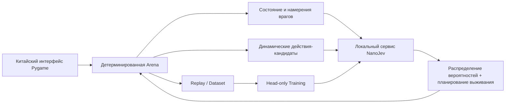

# Jev Arena

<div align="center">

[简体中文](README.md) | [English](README.en.md) | [日本語](README.ja.md) | [한국어](README.ko.md) | **Русский**

**Локальная тактическая арена на базе NanoJev**

[](https://www.python.org/)
[](https://www.pygame.org/)
[](https://github.com/TianyuCodings/NanoJev)
[](#генерация-данных-и-обучение)
[](#тесты-и-проверка)

Это не заранее написанный боевой сценарий: на каждом шаге модель сталкивается с реальными действиями-кандидатами и выбирает между перемещением, атакой, выстрелом, лечением, рывком и цепными реакциями окружения.


*Настоящий игровой движок + локальный сервис NanoJev: уровень 12, шаг 10 — модель выполняет рывок с кадрами неуязвимости.*

</div>

## Что это такое

Jev Arena — это тактическая игра на сетке, целиком работающая локально, а также воспроизводимая экспериментальная площадка для NanoJev, агентов на правилах и алгоритмов поиска.

Игроку нужно собирать самоцветы и живым переходить на следующий уровень. Сложность исходит не только от количества монстров, но и от намерений врагов, опасной местности, ограниченного боезапаса, восстановления навыков, убийств через окружение и боевого темпа, который ускоряется с каждым уровнем.

## Особенности игры

| Система | Текущая реализация |
| --- | --- |
| Тактические ходы | 2 AP за ход: можно комбинировать перемещение, атаку, толчок, выстрел, лечение, рывок, ЭМИ и ожидание |
| Четыре типа врагов | Преследователь, таранщик, бомбер и стрелок — у каждого свои здоровье, урон, темп перемещения и манера атаки |
| Читаемые предвестия атак | Лазеры, тараны и взрывы предупреждаются следами на земле и зонами опасности — без отладочных букв направления и обратных отсчётов |
| Активное оружие | Составной лук наносит высокий урон и отбрасывает врагов; импульсный пистолет бьёт дальше; оружие и ограниченный боезапас сохраняются между уровнями |
| Навыки | Рывок покрывает две клетки и даёт кадры неуязвимости внутри действия, направление выбирается с учётом цели и угроз; ЭМИ прерывает ближайших врагов |
| Взаимодействие с окружением | Костры, шипы, ямы и взрывные бочки — одновременно угроза и средство убийства врагов и запуска цепных взрывов |
| Безопасная генерация | Для самоцветов, аптечек и ключевых предметов всегда существует достижимый без урона маршрут; точки появления никогда не оказываются сразу под лазерным захватом |
| Китайский интерфейс | В реальном времени отображаются вероятности модели, обоснование выбора, время вывода, сложность уровня, боезапас оружия и состояние навыков |

### Сложность — это не просто больше монстров

Уровни постепенно добавляют врагов, препятствия и опасную местность; здоровье врагов растёт на +1 за уровень, урон атак увеличивается ступенчато, при этом разные монстры усиливаются поэтапно:

| Уровень | Изменение темпа |
| --- | --- |
| 6-й уровень | Преследователи перемещаются быстрее |
| 12-й уровень | Таранщики перемещаются быстрее, время подготовки тарана сокращается |
| 18-й уровень | Стрелки перемещаются быстрее, время прицеливания сокращается |
| 24-й уровень | Бомберы немного ускоряются, таранщики переходят на вторую ступень скорости |

После первого уровня ускорения интервал действий дополнительно сокращается на одну ступень каждые 12 уровней, но при этом всегда сохраняется минимум 1 ход предупреждения. Преследователи всегда самые быстрые, далее идут таранщики, а стрелки и бомберы ещё медленнее; жёлтые следы тарана и розовые линии прицеливания используют различные динамические стили предупреждения.

## Быстрый старт

### 1. Подготовка окружения

Рекомендуются Windows, Python 3.10+ и видеокарта NVIDIA. Конфигурация по умолчанию этого проекта проверена на GTX 1660 SUPER 6GB.

```powershell
git clone https://github.com/liao96312/jev-arena-nanojev.git
cd jev-arena-nanojev

python -m venv .venv
.\.venv\Scripts\python.exe -m pip install -r requirements-1660s.txt

git clone --branch jev-arena-1660s https://github.com/liao96312/NanoJev.git third_party/NanoJev
```

Ветка совместимости основана на апстриме [TianyuCodings/NanoJev](https://github.com/TianyuCodings/NanoJev); в этом репозитории также хранится [`patches/nanojev-1660s.patch`](patches/nanojev-1660s.patch), чтобы локальные адаптации оставались проверяемыми.

### 2. Загрузка чекпоинта

```powershell
.\.venv\Scripts\python.exe -c "from huggingface_hub import snapshot_download; snapshot_download(repo_id='C-Tianyu/NanoJev', local_dir='checkpoints/NanoJev', allow_patterns=['variants/games_gold_seed17/*'])"
```

### 3. Запуск игры

Просто дважды щёлкните **`启动游戏.cmd`** в корне проекта.

Лаунчер автоматически выбирает доступный чекпоинт, запускает локальный сервис модели и открывает игровое окно на китайском языке. Если сервис модели недоступен, игра приостанавливается и выводит ошибку, а не переключается молча на другого агента.

Можно запустить и из терминала:

```powershell
.\.venv\Scripts\python.exe scripts\play_gui.py --agent nanojev --seed 61005
```

## Управление

| Клавиша | Действие |
| --- | --- |
| `1` / `2` / `3` / `4` | Переключение Random / Rule / NanoJev / Jev API |
| `←` / `→` | Регулировка скорости принятия решений |
| `Space` | Пауза или продолжение |
| `R` / `F5` | Перезапуск текущего уровня; то же самое делает кнопка в правом нижнем углу |
| `Esc` | Выход |

Решения в игре принимаются агентами автоматически: игрок наблюдает, переключает агентов и управляет темпом демонстрации.

## Как NanoJev участвует в принятии решений



Arena генерирует допустимые действия для текущей позиции и, клонируя окружение, заранее просчитывает немедленные изменения здоровья, убийства, самоцветы, боезапас и угрозы следующего такта. NanoJev возвращает полное распределение вероятностей действий; гибридная политика затем обрабатывает безопасный поиск пути, лечение при низком здоровье, дальние попадания и ограничения против возврата назад.

Вывод модели полностью выполняется локально: удалённый учитель не вызывается, а при сбоях результаты не подделываются.

## Запуск других агентов

```powershell
.\.venv\Scripts\python.exe scripts\play.py --agent random --seed 1
.\.venv\Scripts\python.exe scripts\play.py --agent rule --seed 1
.\.venv\Scripts\python.exe scripts\play.py --agent nanojev --seed 1
.\.venv\Scripts\python.exe scripts\play.py --agent jev --seed 1
```

По умолчанию игра запускает только локальный NanoJev и не читает и не вызывает Jev API. API задействуется только при явном нажатии `4` — ключ считывается из `TYPESAFE_API_KEY`, `TYPESAFE_API_KEY_FILE` или `typesafe-api-key.txt` на рабочем столе; нажатие `1` / `2` / `3` в любой момент безопасно возвращает к локальному агенту, а ключ никогда не записывается в репозиторий.

Запись и воспроизведение:

```powershell
.\.venv\Scripts\python.exe scripts\play.py --agent rule --seed 1 --replay replays/seed1.jsonl
.\.venv\Scripts\python.exe scripts\replay.py replays/seed1.jsonl
```

## Тесты и проверка

```powershell
.\.venv\Scripts\python.exe -m unittest discover -s tests -v
.\.venv\Scripts\python.exe scripts\benchmark.py --episodes 100
.\.venv\Scripts\python.exe scripts\benchmark.py --episodes 4 --max-ticks 100 `
  --agents nanojev --policy hybrid --campaign-level 3 --max-batch-states 2
```

Сейчас окружение, бой, карты, оружие, сохранения, Replay, поиск и адаптеры модели в сумме покрывают **94 регрессионных теста**.

<details>
<summary><strong>Эксперименты и базовые результаты</strong></summary>

- Фиксированные 100 seed × 500 tick: RuleV2 — средняя награда 126.95, Random — 17.49.
- Beam Teacher, 3-й уровень, 10×100: средняя награда 83.44, RuleV2 — 69.76.
- Смоук-тест MCTS Teacher 3×100: средняя награда 79.33, RuleV2 — 63.53.
- Бенчмарк сложности V2: средний коэффициент ветвления 7.317, в 79.92% состояний есть не менее 6 действий.
- Смоук-тест 2 AP head-only: dev CE 2.5745 → 2.1137, пиковая видеопамять GTX 1660S — 2.53 ГБ.
- Быстрый чекпоинт на стратифицированной выборке 100k: 1k записей, 20 шагов, около 5 минут, dev CE 2.4718 → 2.2208, пиковая видеопамять 2.52 ГБ.
- Гибридный бенчмарк на реальном 3-м уровне, 4×100: в 4 из 4 собраны все самоцветы, 0 смертей.
- Дистилляция Beam Teacher на 10k: 500 шагов заняли около 74 минут; в сравнении 4x100 на уровне 3 с тем же seed награда чистой модели выросла с 14.35 до 71.53, а самоцветы — с 0 до 5, но самостоятельно пройти уровень она всё ещё не может; награда гибридной политики выросла с 98.79 до 106.10, и оба варианта прошли 4/4. Это малая дымовая проверка, а не формальный вывод по 100 seed.

Подробные файлы:

- [`baselines/v2/rule_100x500.json`](baselines/v2/rule_100x500.json)
- [`baselines/v2/beam_rule_10x100.json`](baselines/v2/beam_rule_10x100.json)
- [`baselines/v2/mcts_rule_3x100.json`](baselines/v2/mcts_rule_3x100.json)
- [`baselines/v2/complexity_100x100.json`](baselines/v2/complexity_100x100.json)
- [`baselines/v2/nanojev_ap_benchmark_4x100.json`](baselines/v2/nanojev_ap_benchmark_4x100.json)
- [`baselines/v2/beam_distillation_4x100.json`](baselines/v2/beam_distillation_4x100.json)

</details>

## Генерация данных и обучение

Генерация rollout-данных V2:

```powershell
.\.venv\Scripts\python.exe scripts\generate_dataset.py --v2 --records 10000 `
  --targets rollout --rollout-horizon 2 `
  --output datasets/generated/arena_v2_rollout_10k.jsonl
```

Генерация данных объёмом 100k, валидация, аудит токенов и обучение на 500 шагов одним запуском:

```powershell
.\configs\train_nanojev_1660s_v2_100k.ps1
```

Пайплайн дистилляции Beam Teacher:

```powershell
.\configs\train_nanojev_beam_teacher_10k.ps1
```

Пайплайны поддерживают возобновление с контрольной точки и сначала записывают временный файл, перенося его на итоговый путь данных только после завершения валидации, чтобы прерванные артефакты не были ошибочно приняты за полный датасет.

## Языки и технический стек

| Язык / инструмент | Основное применение | Доля в репозитории |
| --- | --- | --- |
| Python 3.10+ | Игровой движок, агенты и поиск, генерация данных, обучение и оценка (49 модулей) | 96.8% |
| PowerShell | Пайплайны обучения GTX 1660S и скрипты запуска в один клик (`configs/`, `scripts/`) | 3.1% |
| Batch | Единая точка входа для запуска `启动游戏.cmd` | менее 0.1% |
| Markdown + Mermaid | README и документы технических решений V2 / дальнего оружия / 1660S | не учитывается |

## Структура проекта

```text
arena/            игровое окружение, генерация уровней, логика врагов и рендеринг
agents/           агенты Random, Rule, MCTS и NanoJev
nanojev_adapter/  протокол запросов, клиент и гибридная политика
assets/           персонажи, монстры, предметы, эффекты и скриншоты геймплея
scripts/          запуск игры, оценка, инструменты данных и обучения
configs/          воспроизводимые пайплайны обучения GTX 1660S
datasets/         датасеты и манифесты
baselines/        базовые результаты и отчёты
tests/            регрессионные тесты
```

## Дорожная карта

- План тактического апгрейда V2: [`JEV_ARENA_V2_ROADMAP.md`](JEV_ARENA_V2_ROADMAP.md)
- План дальнобойного оружия: [`JEV_ARENA_RANGED_WEAPONS_PLAN.md`](JEV_ARENA_RANGED_WEAPONS_PLAN.md)
- Техническое решение GTX 1660S / NanoJev: [`jev_arena_nanojev_gtx1660s_plan.md`](jev_arena_nanojev_gtx1660s_plan.md)

Проект продолжает активно развиваться: цель — не модель, которая умеет лишь идти по кратчайшему пути, а модель, каждое действие которой отражает наблюдаемое, проверяемое и воспроизводимое тактическое решение.
